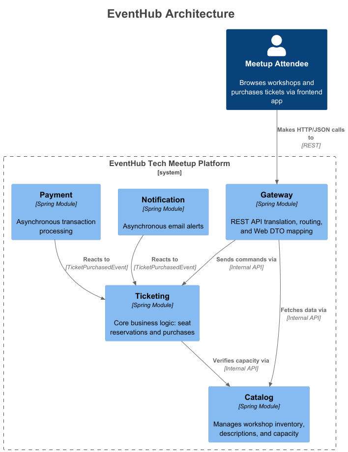

# EventHub - Modular Monolithic API


**EventHub** is a backend REST API for a tech meetup and workshop ticketing platform.

Instead of a traditional layered monolith or a premature microservices architecture, this project was intentionally designed as a **Modular Monolith** using **Domain-Driven Design (DDD)** principles and **Spring Modulith**. It demonstrates strict bounded contexts, internal API encapsulation, and event-driven cross-module communication.

---

## Architectural Highlights

* **Strict Encapsulation:** Modules interact exclusively through designated internal interface APIs (`CatalogInternalAPI`). Core domain logic and JPA repositories are `package-private` to prevent dependency leakage.
* **Event-Driven Architecture (EDA):** Cross-domain side effects (like processing payments and sending email notifications) are decoupled using Spring Application Events (`TicketPurchasedEvent`), preventing synchronous blocking.
* **Hexagonal Principles:** The `Gateway` module acts as the sole Web transport adapter. Web DTOs (JSON) are mapped to Domain DTOs within the Gateway, keeping the core domains completely ignorant of HTTP and REST.
* **Safe Financial Types:** Utilizes `BigDecimal` for all monetary transactions to prevent floating-point inaccuracies.
* **Architectural Testing:** Uses `spring-modulith-starter-test` and ArchUnit to mathematically verify that no module violates package visibility or creates circular dependencies.

---

## Module Structure & C4 Architecture



*(Auto-generated via Spring Modulith Documenter & PlantUML)*

The application is strictly divided into 5 modules:

1. **`gateway`**: The REST Controller layer. Handles HTTP request routing, DTO translation, and global exception handling (`@RestControllerAdvice`).
2. **`catalog`**: Manages workshop inventory, descriptions, and capacity rules.
3. **`ticketing`**: The core business transaction layer. Verifies capacity with the catalog, generates tickets, and publishes domain events.
4. **`payment`**: An asynchronous event listener that mocks financial transactions.
5. **`notification`**: An asynchronous event listener that mocks email dispatch.

---

## Tech Stack

* **Java 25** (Records, modern Streams)
* **Spring Boot 4.0.5** (Web, Data JPA)
* **Spring Modulith** (Events, Architecture Verification)
* **MapStruct & Lombok** (Boilerplate reduction and pure DTO mapping)
* **H2 Database** (In-memory storage for rapid MVP deployment)
* **OpenAPI 3 / Swagger** (Interactive API documentation)

---

## Running the Application Locally

**1. Clone the repository**
```bash
git clone https://github.com/GaskaPiotr/EventHub.git
cd EventHub
```

**2. Run the application using Maven**
```bash
./mvnw spring-boot:run
```

**3. Access the Swagger UI**
Once the application is running on port 8080, navigate to the interactive API documentation to test the endpoints:
 **http://localhost:8080/swagger-ui.html**

---

## Running the Architectural Tests

To prove the modular boundaries are intact, run the Modulith verification tests:
```bash
./mvnw test
```
*If a developer accidentally imports a `ticketing` repository into the `catalog` module, this test will fail the build.*